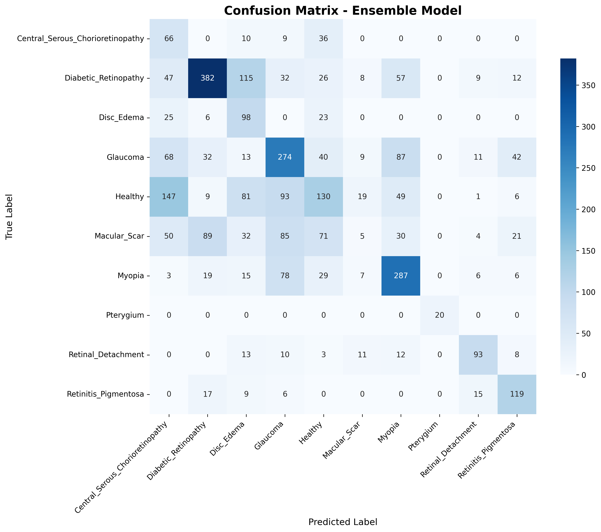
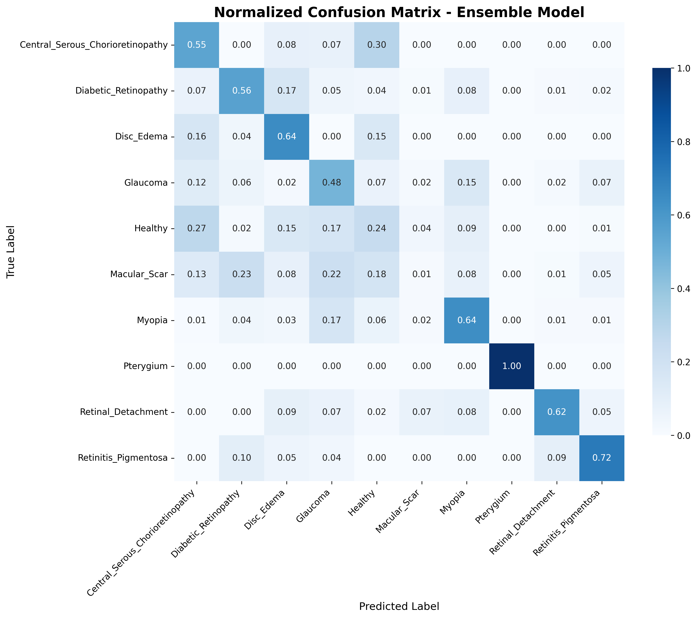
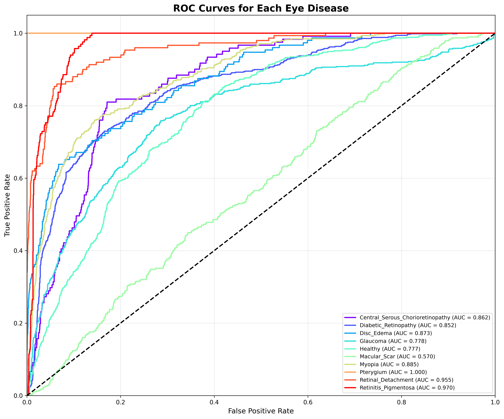
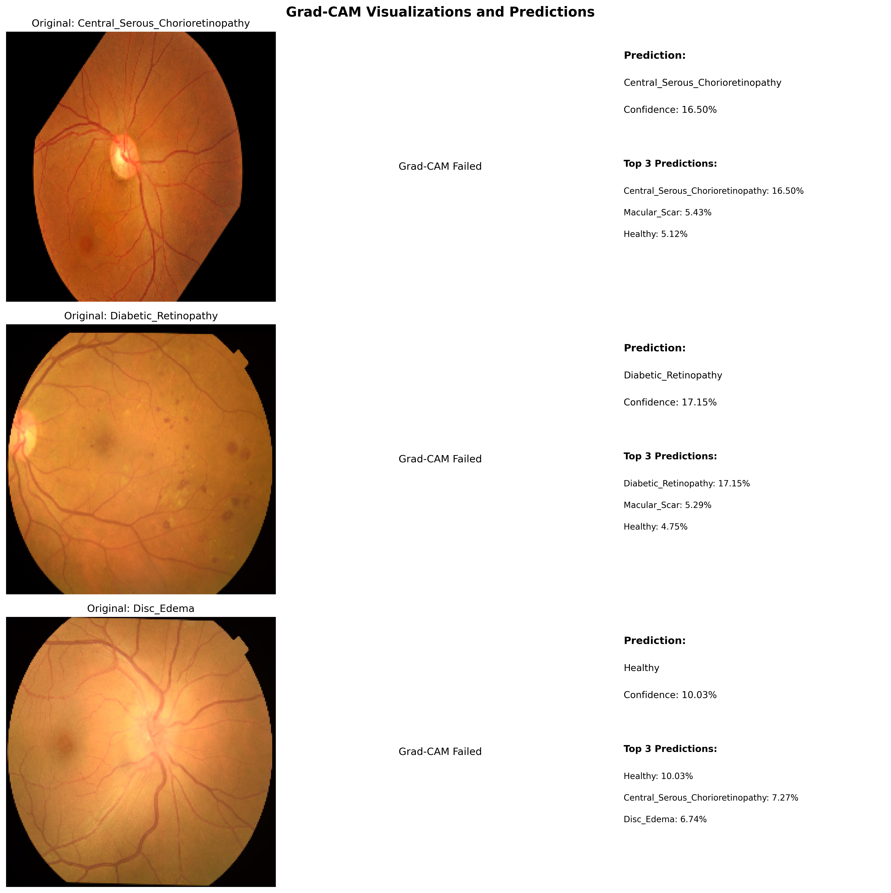
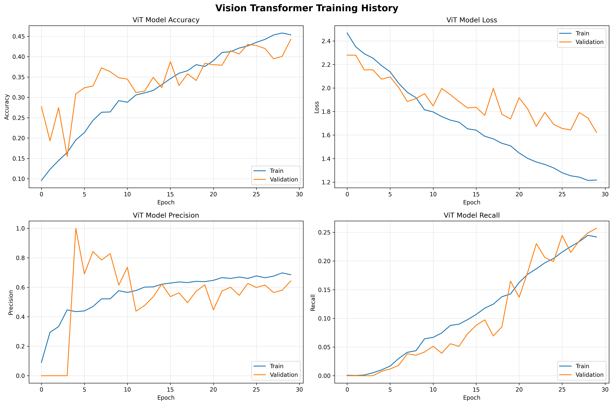
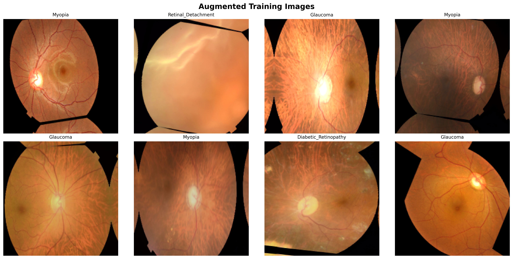

# Eye Disease Classification

This repository contains an AI project for classifying eye diseases from retinal images. It includes data preprocessing, model training notebooks, trained models, and a small Flask web app for inference.

## Quick Start

- Create a Python virtual environment and activate it.
- Install dependencies:

```powershell
python -m pip install -r requirements.txt
```

- Run the web app (from project root):

```powershell
python .\web_app\app.py
```

Open `http://127.0.0.1:5000/` in your browser.

## Results

The `results/eye_disease` folder contains analysis artifacts and visualizations produced during training and evaluation. Preview of key images:

- Class distribution
	

- Confusion matrix
	

- Normalized confusion matrix
	

- ROC curves
	

- Grad-CAM visualizations
	

- Sample images
	

- Training history (ViT)
	

- Augmented images overview
	

- Performance summary (CSV): `results/eye_disease/performance_summary.csv`
- Classification report (CSV): `results/eye_disease/classification_report.csv`

## Notes
- If the web app shows "Model: Unavailable", check `web_app/app.py` logs or visit `http://127.0.0.1:5000/status` for the model load error details.
- The project expects the dataset under `data/` as organized in the repo. See notebooks for preprocessing and training steps.

If you want, I can add automatic thumbnails of these images into the docs, or generate an HTML gallery page under `results/`.

